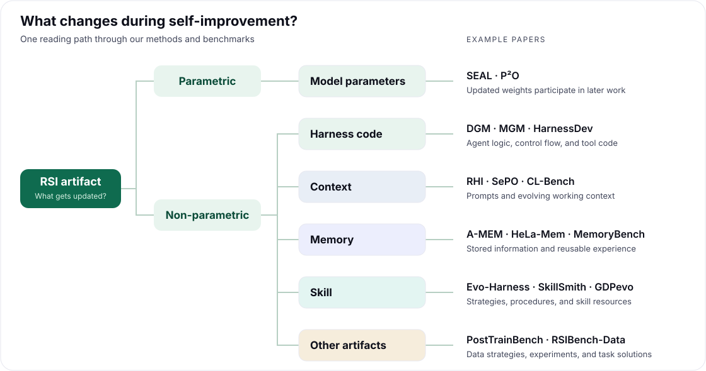
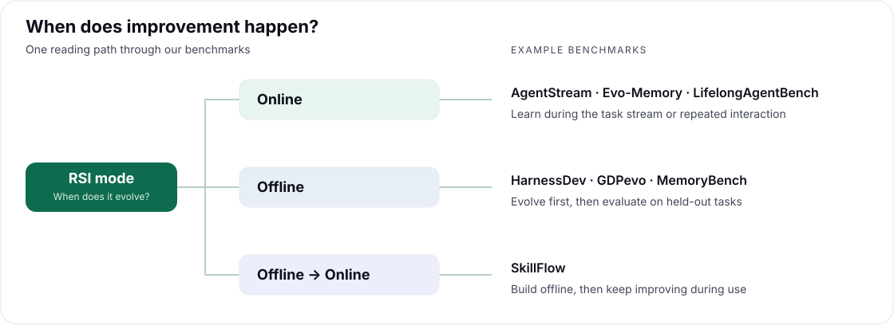

<div align="center">

<a href="https://prism-shadow.github.io/awesome-rsi/">
  
</a>

<a href="https://prism-shadow.github.io/awesome-rsi/">
  
</a>

<!-- DEMO VIDEO: Add the GitHub-hosted walkthrough video URL here once the recording is ready. -->

</div>

## Start here

Awesome RSI collects **benchmarks, methods, and systems for Recursive Self-Improvement**. We follow the loop: an agent performs tasks, learns from trajectories and feedback, updates its own state, and uses that updated state in later work. That state can be model parameters, harness code, context, memory, or skills.

<!-- BEGIN GENERATED COUNTS -->

**50 method papers · 30 benchmark papers · 3 systems**

<!-- END GENERATED COUNTS -->

| Looking for… | Start with… |
| :--- | :--- |
| An introduction to RSI | [Understanding RSI](https://prism-shadow.github.io/awesome-rsi/#blog/understanding-rsi) — an illustrated guide, available in English and Chinese. |
| A method to build on | [Methods & Systems](https://prism-shadow.github.io/awesome-rsi/#methods) — filter by artifacts, topology, feedback, and more. |
| A way to measure improvement | [Benchmarks](https://prism-shadow.github.io/awesome-rsi/) — compare artifacts and online, offline, or hybrid protocols. |
| Connections between papers | [Citation graphs](https://prism-shadow.github.io/awesome-rsi/#graph-methods) — switch between methods and benchmarks, search for a node, zoom, and pan. |
| More background | [Books, courses, and learning materials](https://prism-shadow.github.io/awesome-rsi/#resources). |

## Paper map

Each list in this README is organized along **one dimension**: **RSI artifact** for methods and systems, and **RSI mode** for benchmarks. For more ways to explore the collection, visit the [Awesome RSI website](https://prism-shadow.github.io/awesome-rsi/), where you can compare additional dimensions and combine filters to find work that matches your interests.

**What does the agent improve?** The tree below follows the RSI artifact dimension.

<a href="assets/readme/paper-map.svg">
  
</a>

[Model parameters](#model-parameters) · [Harness code](#harness-code) · [Context](#context) · [Memory](#memory) · [Skill](#skill) · [Other artifacts](#other-artifacts) · [Benchmarks](#benchmarks)

The tree shows examples from the collection. The lists below use the website's existing labels; a work can appear under multiple artifacts. Inclusion covers both explicit self-modification and experience-driven improvement during long-running tasks.

<!-- BEGIN GENERATED CATALOG -->

## Methods & Systems

[Compare all dimensions on the website →](https://prism-shadow.github.io/awesome-rsi/#methods)

Grouped by RSI artifact and ordered by first publication or project release date, newest first. Conference labels reflect the venue recorded in the collection; projects link to their repositories.

### Model parameters

The student's model parameters are updated to improve task performance. This includes a teacher using student performance feedback to refine successive training rounds, even when each round restarts from the initial model, as well as the updated student continuing to learn from later tasks.

| Paper or project | Publication |
| :--- | :--- |
| [Reef: Continual Learning Infrastructure for Self-Improving Agents](https://github.com/Human-Agent-Society/reef) | Project · v0.0.2 |
| [HarnessX: A Composable, Adaptive, and Evolvable Agent Harness Foundry](https://arxiv.org/abs/2606.14249) | arXiv preprint |
| [ExpGraph: Model-Agnostic Experience Learning with Graph-Structured Memory for LLM Agents](https://arxiv.org/abs/2605.30712) | arXiv preprint |
| [Continual Harness: Online Adaptation for Self-Improving Foundation Agents](https://arxiv.org/abs/2605.09998) | arXiv preprint |
| [P²O: Joint Policy and Prompt Optimization](https://arxiv.org/abs/2603.21877) | arXiv preprint |
| [Self-Adapting Language Models](https://arxiv.org/abs/2506.10943) | NeurIPS 2025 |

### Harness code

Executable agent, harness, control-flow, self-improvement, or tool code is modified.

| Paper or project | Publication |
| :--- | :--- |
| [Dream-RSI: Recursive Self-Improvement through Evolving Worlds](https://dream-rsi.com/assets/dream-rsi.pdf) | Preprint |
| [Reef: Continual Learning Infrastructure for Self-Improving Agents](https://github.com/Human-Agent-Society/reef) | Project · v0.0.2 |
| [HarnessEvolve: Learning from Reference Trajectories for Reliable Agent Self-Evolution](https://arxiv.org/abs/2609.00829) | arXiv preprint |
| [Proteus: A Harness-Agnostic Self-Evolution Framework for AI Agents](https://github.com/proteus-evolve/Proteus) | Project · v0.3.0 |
| [Mendel Gödel Machine: Recursive Self-Improving Coding Agents via Comparative Evolution](https://arxiv.org/abs/2608.07645) | arXiv preprint |
| [EvolveNet: Collaborative Harness Evolution for Agent Self-Improvement](https://arxiv.org/abs/2608.04968) | arXiv preprint |
| [DarwinX: Evolving Agent Harnesses Through Natural Selection](https://arxiv.org/abs/2608.07545) | arXiv preprint |
| [HarnessBank: Semantic Gene-Bank Search with Gated Verification for Agent-Harness Self-Evolution](https://arxiv.org/abs/2607.13683) | arXiv preprint |
| [The Red Queen Gödel Machine: Co-Evolving Agents and Their Evaluators](https://arxiv.org/abs/2606.26294) | arXiv preprint |
| [HarnessX: A Composable, Adaptive, and Evolvable Agent Harness Foundry](https://arxiv.org/abs/2606.14249) | arXiv preprint |
| [Self-Harness: Harnesses That Improve Themselves](https://arxiv.org/abs/2606.09498) | arXiv preprint |
| [From Failed Trajectories to Reliable LLM Agents: Diagnosing and Repairing Harness Flaws](https://arxiv.org/abs/2606.06324) | arXiv preprint |
| [SkillSmith: Co-Evolving Skills and Tools for Self-Improving Agent Systems](https://arxiv.org/abs/2606.01314) | arXiv preprint |
| [PANDO: Efficient Multimodal AI Agents via Online Skill Distillation](https://arxiv.org/abs/2605.24785) | arXiv preprint |
| [DemoEvolve: Overcoming Sparse Feedback in Agentic Harness Evolution with Demonstrations](https://arxiv.org/abs/2605.24539) | arXiv preprint |
| [MOSS: Self-Evolution through Source-Level Rewriting in Autonomous Agent Systems](https://arxiv.org/abs/2605.22794) | arXiv preprint |
| [Continual Harness: Online Adaptation for Self-Improving Foundation Agents](https://arxiv.org/abs/2605.09998) | arXiv preprint |
| [Agentic Harness Engineering: Observability-Driven Automatic Evolution of Coding-Agent Harnesses](https://arxiv.org/abs/2604.25850) | arXiv preprint |
| [Escher-Loop: Mutual Evolution by Closed-Loop Self-Referential Optimization](https://arxiv.org/abs/2604.23472) | arXiv preprint |
| [Mem²Evolve: Towards Self-Evolving Agents via Co-Evolutionary Capability Expansion and Experience Distillation](https://arxiv.org/abs/2604.10923) | ACL 2026 |
| [Meta-Harness: End-to-End Optimization of Model Harnesses](https://arxiv.org/abs/2603.28052) | arXiv preprint |
| [Hyperagents](https://arxiv.org/abs/2603.19461) | arXiv preprint |
| [Group-Evolving Agents: Open-Ended Self-Improvement via Experience Sharing](https://arxiv.org/abs/2602.04837) | arXiv preprint |
| [Darwin Gödel Machine: Open-Ended Evolution of Self-Improving Agents](https://arxiv.org/abs/2505.22954) | ICLR 2026 |
| [Gödel Agent: A Self-Referential Agent Framework for Recursive Self-Improvement](https://arxiv.org/abs/2410.04444) | ACL 2025 |

### Context

Prompts or working context are updated. Observations, feedback, and experience can accumulate or be reorganized during a continuous run to guide later actions or tasks.

| Paper or project | Publication |
| :--- | :--- |
| [Dream-RSI: Recursive Self-Improvement through Evolving Worlds](https://dream-rsi.com/assets/dream-rsi.pdf) | Preprint |
| [SkillAdam: Stable and Efficient Skill Evolution for Agents](https://arxiv.org/abs/2609.08944) | arXiv preprint |
| [Reef: Continual Learning Infrastructure for Self-Improving Agents](https://github.com/Human-Agent-Society/reef) | Project · v0.0.2 |
| [SkillGLoW: Procedural-Family Skill Consolidation for Self-Improving Agents on Long-Horizon Task Streams](https://arxiv.org/abs/2609.02217) | arXiv preprint |
| [HarnessEvolve: Learning from Reference Trajectories for Reliable Agent Self-Evolution](https://arxiv.org/abs/2609.00829) | arXiv preprint |
| [WikiSkill: Compiling Agent Experience into Persistent Knowledge for Skill Evolution](https://arxiv.org/abs/2608.27454) | arXiv preprint |
| [Recursive Experiential-Working Memory Evolution for Long-Horizon Agent Harnesses](https://arxiv.org/abs/2608.24876) | arXiv preprint |
| [MediSkill-Evo: Process-Constrained Self-Evolution for Evidence-Grounded Clinical Interaction](https://arxiv.org/abs/2608.23397) | arXiv preprint |
| [Prime Agent: A Self-Improving RLM Harness](https://arxiv.org/abs/2608.23552) | arXiv preprint |
| [Proteus: A Harness-Agnostic Self-Evolution Framework for AI Agents](https://github.com/proteus-evolve/Proteus) | Project · v0.3.0 |
| [TRACE: A Self-Evolving Skill Bank for Consistent, Limit-Aware LLM Agents](https://arxiv.org/abs/2608.22793) | arXiv preprint |
| [HyperSkill: Self-Evolving LLM Agents via Hypergraph-Structured Skill Memory](https://arxiv.org/abs/2608.16114) | arXiv preprint |
| [Evo-Harness: Context-to-Harness Skill Compilation for Self-Evolving Agents](https://arxiv.org/abs/2608.15071) | arXiv preprint |
| [DIVE: Unlocking Self-Improvement in Frozen Language Models Through Diversity-Driven Skill Evolution](https://arxiv.org/abs/2608.12486) | arXiv preprint |
| [Mendel Gödel Machine: Recursive Self-Improving Coding Agents via Comparative Evolution](https://arxiv.org/abs/2608.07645) | arXiv preprint |
| [EvolveNet: Collaborative Harness Evolution for Agent Self-Improvement](https://arxiv.org/abs/2608.04968) | arXiv preprint |
| [DarwinX: Evolving Agent Harnesses Through Natural Selection](https://arxiv.org/abs/2608.07545) | arXiv preprint |
| [Recursive Harness Self-Improvement](https://arxiv.org/abs/2607.15524) | arXiv preprint |
| [HarnessBank: Semantic Gene-Bank Search with Gated Verification for Agent-Harness Self-Evolution](https://arxiv.org/abs/2607.13683) | arXiv preprint |
| [The Red Queen Gödel Machine: Co-Evolving Agents and Their Evaluators](https://arxiv.org/abs/2606.26294) | arXiv preprint |
| [When Rules Learn: A Self-Evolving Agent for Legal Case Retrieval](https://arxiv.org/abs/2606.17220) | ACL 2026 |
| [HarnessX: A Composable, Adaptive, and Evolvable Agent Harness Foundry](https://arxiv.org/abs/2606.14249) | arXiv preprint |
| [Self-Harness: Harnesses That Improve Themselves](https://arxiv.org/abs/2606.09498) | arXiv preprint |
| [From Failed Trajectories to Reliable LLM Agents: Diagnosing and Repairing Harness Flaws](https://arxiv.org/abs/2606.06324) | arXiv preprint |
| [SePO: Self-Evolving Prompt Agent for System Prompt Optimization](https://arxiv.org/abs/2606.04465) | arXiv preprint |
| [SkillRevise: Improving LLM-Authored Agent Skills via Trace-Conditioned Skill Revision](https://arxiv.org/abs/2606.01139) | Findings of EMNLP 2026 |
| [ExpGraph: Model-Agnostic Experience Learning with Graph-Structured Memory for LLM Agents](https://arxiv.org/abs/2605.30712) | arXiv preprint |
| [PANDO: Efficient Multimodal AI Agents via Online Skill Distillation](https://arxiv.org/abs/2605.24785) | arXiv preprint |
| [DemoEvolve: Overcoming Sparse Feedback in Agentic Harness Evolution with Demonstrations](https://arxiv.org/abs/2605.24539) | arXiv preprint |
| [Continual Harness: Online Adaptation for Self-Improving Foundation Agents](https://arxiv.org/abs/2605.09998) | arXiv preprint |
| [Agentic Harness Engineering: Observability-Driven Automatic Evolution of Coding-Agent Harnesses](https://arxiv.org/abs/2604.25850) | arXiv preprint |
| [Mem²Evolve: Towards Self-Evolving Agents via Co-Evolutionary Capability Expansion and Experience Distillation](https://arxiv.org/abs/2604.10923) | ACL 2026 |
| [Meta-Harness: End-to-End Optimization of Model Harnesses](https://arxiv.org/abs/2603.28052) | arXiv preprint |
| [P²O: Joint Policy and Prompt Optimization](https://arxiv.org/abs/2603.21877) | arXiv preprint |
| [Hyperagents](https://arxiv.org/abs/2603.19461) | arXiv preprint |
| [Group-Evolving Agents: Open-Ended Self-Improvement via Experience Sharing](https://arxiv.org/abs/2602.04837) | arXiv preprint |
| [Agentic Context Engineering: Evolving Contexts for Self-Improving Language Models](https://arxiv.org/abs/2510.04618) | ICLR 2026 |
| [ReasoningBank: Scaling Agent Self-Evolving with Reasoning Memory](https://arxiv.org/abs/2509.25140) | ICLR 2026 |
| [Memp: Exploring Agent Procedural Memory](https://arxiv.org/abs/2508.06433) | Findings of ACL 2026 |
| [GEPA: Reflective Prompt Evolution Can Outperform Reinforcement Learning](https://arxiv.org/abs/2507.19457) | ICLR 2026 Oral |
| [Darwin Gödel Machine: Open-Ended Evolution of Self-Improving Agents](https://arxiv.org/abs/2505.22954) | ICLR 2026 |
| [Dynamic Cheatsheet: Test-Time Learning with Adaptive Memory](https://arxiv.org/abs/2504.07952) | EACL 2026 |
| [Gödel Agent: A Self-Referential Agent Framework for Recursive Self-Improvement](https://arxiv.org/abs/2410.04444) | ACL 2025 |
| [Cradle: Empowering Foundation Agents Towards General Computer Control](https://arxiv.org/abs/2403.03186) | ICML 2025 |

### Memory

Information or experience is stored, updated, and retrieved across steps, trajectories, or tasks.

| Paper or project | Publication |
| :--- | :--- |
| [ReMe: A Local-First, Self-Evolving Personal Knowledge Base for AI Agents](https://github.com/agentscope-ai/ReMe) | Project · v0.4.1.12 |
| [Dream-RSI: Recursive Self-Improvement through Evolving Worlds](https://dream-rsi.com/assets/dream-rsi.pdf) | Preprint |
| [SkillAdam: Stable and Efficient Skill Evolution for Agents](https://arxiv.org/abs/2609.08944) | arXiv preprint |
| [SkillGLoW: Procedural-Family Skill Consolidation for Self-Improving Agents on Long-Horizon Task Streams](https://arxiv.org/abs/2609.02217) | arXiv preprint |
| [WikiSkill: Compiling Agent Experience into Persistent Knowledge for Skill Evolution](https://arxiv.org/abs/2608.27454) | arXiv preprint |
| [Recursive Experiential-Working Memory Evolution for Long-Horizon Agent Harnesses](https://arxiv.org/abs/2608.24876) | arXiv preprint |
| [MediSkill-Evo: Process-Constrained Self-Evolution for Evidence-Grounded Clinical Interaction](https://arxiv.org/abs/2608.23397) | arXiv preprint |
| [Prime Agent: A Self-Improving RLM Harness](https://arxiv.org/abs/2608.23552) | arXiv preprint |
| [Proteus: A Harness-Agnostic Self-Evolution Framework for AI Agents](https://github.com/proteus-evolve/Proteus) | Project · v0.3.0 |
| [HyperSkill: Self-Evolving LLM Agents via Hypergraph-Structured Skill Memory](https://arxiv.org/abs/2608.16114) | arXiv preprint |
| [ISM: Self-Improving Strategy Memory for Continual Mathematical Reasoning](https://arxiv.org/abs/2606.31191) | ICML 2026 AI for Math Workshop |
| [HarnessX: A Composable, Adaptive, and Evolvable Agent Harness Foundry](https://arxiv.org/abs/2606.14249) | arXiv preprint |
| [Self-Harness: Harnesses That Improve Themselves](https://arxiv.org/abs/2606.09498) | arXiv preprint |
| [From Failed Trajectories to Reliable LLM Agents: Diagnosing and Repairing Harness Flaws](https://arxiv.org/abs/2606.06324) | arXiv preprint |
| [SkillSmith: Co-Evolving Skills and Tools for Self-Improving Agent Systems](https://arxiv.org/abs/2606.01314) | arXiv preprint |
| [ExpGraph: Model-Agnostic Experience Learning with Graph-Structured Memory for LLM Agents](https://arxiv.org/abs/2605.30712) | arXiv preprint |
| [PANDO: Efficient Multimodal AI Agents via Online Skill Distillation](https://arxiv.org/abs/2605.24785) | arXiv preprint |
| [Continual Harness: Online Adaptation for Self-Improving Foundation Agents](https://arxiv.org/abs/2605.09998) | arXiv preprint |
| [Agentic Harness Engineering: Observability-Driven Automatic Evolution of Coding-Agent Harnesses](https://arxiv.org/abs/2604.25850) | arXiv preprint |
| [HeLa-Mem: Hebbian Learning and Associative Memory for LLM Agents](https://arxiv.org/abs/2604.16839) | ACL 2026 |
| [Mem²Evolve: Towards Self-Evolving Agents via Co-Evolutionary Capability Expansion and Experience Distillation](https://arxiv.org/abs/2604.10923) | ACL 2026 |
| [Meta-Harness: End-to-End Optimization of Model Harnesses](https://arxiv.org/abs/2603.28052) | arXiv preprint |
| [Hyperagents](https://arxiv.org/abs/2603.19461) | arXiv preprint |
| [Agentic Context Engineering: Evolving Contexts for Self-Improving Language Models](https://arxiv.org/abs/2510.04618) | ICLR 2026 |
| [ReasoningBank: Scaling Agent Self-Evolving with Reasoning Memory](https://arxiv.org/abs/2509.25140) | ICLR 2026 |
| [Memp: Exploring Agent Procedural Memory](https://arxiv.org/abs/2508.06433) | Findings of ACL 2026 |
| [Dynamic Cheatsheet: Test-Time Learning with Adaptive Memory](https://arxiv.org/abs/2504.07952) | EACL 2026 |
| [A-MEM: Agentic Memory for LLM Agents](https://arxiv.org/abs/2502.12110) | NeurIPS 2025 |
| [Agent Workflow Memory](https://arxiv.org/abs/2409.07429) | ICML 2025 |
| [Cradle: Empowering Foundation Agents Towards General Computer Control](https://arxiv.org/abs/2403.03186) | ICML 2025 |

### Skill

Reusable strategies, procedures, workflows, or skill resources are created and revised.

| Paper or project | Publication |
| :--- | :--- |
| [ReMe: A Local-First, Self-Evolving Personal Knowledge Base for AI Agents](https://github.com/agentscope-ai/ReMe) | Project · v0.4.1.12 |
| [SkillAdam: Stable and Efficient Skill Evolution for Agents](https://arxiv.org/abs/2609.08944) | arXiv preprint |
| [Reef: Continual Learning Infrastructure for Self-Improving Agents](https://github.com/Human-Agent-Society/reef) | Project · v0.0.2 |
| [SkillGLoW: Procedural-Family Skill Consolidation for Self-Improving Agents on Long-Horizon Task Streams](https://arxiv.org/abs/2609.02217) | arXiv preprint |
| [HarnessEvolve: Learning from Reference Trajectories for Reliable Agent Self-Evolution](https://arxiv.org/abs/2609.00829) | arXiv preprint |
| [WikiSkill: Compiling Agent Experience into Persistent Knowledge for Skill Evolution](https://arxiv.org/abs/2608.27454) | arXiv preprint |
| [Recursive Experiential-Working Memory Evolution for Long-Horizon Agent Harnesses](https://arxiv.org/abs/2608.24876) | arXiv preprint |
| [MediSkill-Evo: Process-Constrained Self-Evolution for Evidence-Grounded Clinical Interaction](https://arxiv.org/abs/2608.23397) | arXiv preprint |
| [Prime Agent: A Self-Improving RLM Harness](https://arxiv.org/abs/2608.23552) | arXiv preprint |
| [Proteus: A Harness-Agnostic Self-Evolution Framework for AI Agents](https://github.com/proteus-evolve/Proteus) | Project · v0.3.0 |
| [TRACE: A Self-Evolving Skill Bank for Consistent, Limit-Aware LLM Agents](https://arxiv.org/abs/2608.22793) | arXiv preprint |
| [HyperSkill: Self-Evolving LLM Agents via Hypergraph-Structured Skill Memory](https://arxiv.org/abs/2608.16114) | arXiv preprint |
| [Evo-Harness: Context-to-Harness Skill Compilation for Self-Evolving Agents](https://arxiv.org/abs/2608.15071) | arXiv preprint |
| [DIVE: Unlocking Self-Improvement in Frozen Language Models Through Diversity-Driven Skill Evolution](https://arxiv.org/abs/2608.12486) | arXiv preprint |
| [DarwinX: Evolving Agent Harnesses Through Natural Selection](https://arxiv.org/abs/2608.07545) | arXiv preprint |
| [ISM: Self-Improving Strategy Memory for Continual Mathematical Reasoning](https://arxiv.org/abs/2606.31191) | ICML 2026 AI for Math Workshop |
| [When Rules Learn: A Self-Evolving Agent for Legal Case Retrieval](https://arxiv.org/abs/2606.17220) | ACL 2026 |
| [SkillRevise: Improving LLM-Authored Agent Skills via Trace-Conditioned Skill Revision](https://arxiv.org/abs/2606.01139) | Findings of EMNLP 2026 |
| [SkillSmith: Co-Evolving Skills and Tools for Self-Improving Agent Systems](https://arxiv.org/abs/2606.01314) | arXiv preprint |
| [ExpGraph: Model-Agnostic Experience Learning with Graph-Structured Memory for LLM Agents](https://arxiv.org/abs/2605.30712) | arXiv preprint |
| [PANDO: Efficient Multimodal AI Agents via Online Skill Distillation](https://arxiv.org/abs/2605.24785) | arXiv preprint |
| [Continual Harness: Online Adaptation for Self-Improving Foundation Agents](https://arxiv.org/abs/2605.09998) | arXiv preprint |
| [Agentic Harness Engineering: Observability-Driven Automatic Evolution of Coding-Agent Harnesses](https://arxiv.org/abs/2604.25850) | arXiv preprint |
| [Mem²Evolve: Towards Self-Evolving Agents via Co-Evolutionary Capability Expansion and Experience Distillation](https://arxiv.org/abs/2604.10923) | ACL 2026 |
| [Agentic Context Engineering: Evolving Contexts for Self-Improving Language Models](https://arxiv.org/abs/2510.04618) | ICLR 2026 |
| [Memp: Exploring Agent Procedural Memory](https://arxiv.org/abs/2508.06433) | Findings of ACL 2026 |
| [Dynamic Cheatsheet: Test-Time Learning with Adaptive Memory](https://arxiv.org/abs/2504.07952) | EACL 2026 |
| [Agent Workflow Memory](https://arxiv.org/abs/2409.07429) | ICML 2025 |
| [Cradle: Empowering Foundation Agents Towards General Computer Control](https://arxiv.org/abs/2403.03186) | ICML 2025 |

### Other artifacts

Other artifacts evolve, such as data strategies, experiment configurations, or task solutions.

Currently represented in the [benchmark collection](#benchmarks), including data strategies, experiment configurations, and evolving task solutions.

## Benchmarks

[Compare benchmark dimensions on the website →](https://prism-shadow.github.io/awesome-rsi/)

Grouped by RSI mode, newest first. Benchmarks that support multiple protocols appear in each relevant group. Artifact labels describe what evolves in the evaluated workflow.

<a href="assets/readme/benchmark-map.svg">
  
</a>

[Online](#online) · [Offline](#offline) · [Offline → Online](#offline-to-online)

### Online

Experience accumulates during the task stream or repeated interaction, and later work can use it.

| Benchmark paper | Year | RSI artifact |
| :--- | :--- | :--- |
| [FinEvo-Bench: A Longitudinal Benchmark for Self-Evolving Agents in Professional Financial Workflows](https://arxiv.org/abs/2608.06144) | 2026 | Memory · Skill |
| [ContinualSkillBench: Can LLM Agents Truly Evolve Their Capabilities?](https://arxiv.org/abs/2608.03874) | 2026 | Context · Skill |
| [PAST-Bench: Benchmarking the Foundations of Recursive Self-Improvement in Personal Agents](https://arxiv.org/abs/2608.04003) | 2026 | Memory · Skill |
| [PATH-Bench: Path-Dependent Evaluation of Lifelong Agents](https://arxiv.org/abs/2608.01149) | 2026 | Context · Memory · Skill |
| [AgentStream: How Well Do Self-Evolving LLM Agents Perform Under Streaming Tasks?](https://arxiv.org/abs/2608.00155) | 2026 | Context · Memory · Skill |
| [RSIBench-Data: Benchmarking Data-Centric Research for Recursive Self-Improvement](https://arxiv.org/abs/2607.25886) | 2026 | Context · Other artifacts |
| [EdgeBench: Unveiling Scaling Laws of Learning from Real-World Environments](https://arxiv.org/abs/2607.05155) | 2026 | Context · Other artifacts |
| [Continual Learning Bench: Evaluating Frontier AI Systems in Real-World Stateful Environments](https://arxiv.org/abs/2606.05661) | 2026 | Context · Memory · Other artifacts |
| [AutoLab: Can Frontier Models Solve Long-Horizon Auto Research and Engineering Tasks?](https://arxiv.org/abs/2606.05080) | 2026 | Context · Other artifacts |
| [Can Generalist Agents Automate Data Curation?](https://arxiv.org/abs/2606.04261) | 2026 | Context · Other artifacts |
| [EvoMemBench: Benchmarking Agent Memory from a Self-Evolving Perspective](https://arxiv.org/abs/2605.18421) | 2026 | Context · Memory |
| [MLS-Bench: A Holistic and Rigorous Assessment of AI Systems on Building Better AI](https://arxiv.org/abs/2605.08678) | 2026 | Context · Other artifacts |
| [SkillLearnBench: Benchmarking Continual Learning Methods for Agent Skill Generation on Real-World Tasks](https://arxiv.org/abs/2604.20087) | 2026 | Skill |
| [SkillFlow: Benchmarking Lifelong Skill Discovery and Evolution for Autonomous Agents](https://arxiv.org/abs/2604.17308) | 2026 | Context · Skill |
| [Agent² RL-Bench: Can LLM Agents Engineer Agentic RL Post-Training?](https://arxiv.org/abs/2604.10547) | 2026 | Context · Other artifacts |
| [PostTrainBench: Can LLM Agents Automate LLM Post-Training?](https://arxiv.org/abs/2603.08640) | 2026 | Context · Other artifacts |
| [Evo-Memory: Benchmarking LLM Agent Test-time Learning with Self-Evolving Memory](https://arxiv.org/abs/2511.20857) | 2025 | Context · Memory |
| [Building Self-Evolving Agents via Experience-Driven Lifelong Learning: A Framework and Benchmark](https://arxiv.org/abs/2508.19005) | 2025 | Context · Memory · Skill |
| [LifelongAgentBench: Evaluating LLM Agents as Lifelong Learners](https://arxiv.org/abs/2505.11942) | 2025 | Context · Memory |

### Offline

Evolution precedes a separate held-out evaluation.

| Benchmark paper | Year | RSI artifact |
| :--- | :--- | :--- |
| [HarnessDev: Can LLMs Create and Evolve Their Own Agent Harness?](https://arxiv.org/abs/2609.01437) | 2026 | Harness code · Context |
| [S3Gym: Can LLMs Turn Self-Testing and Self-Judging into Self-Improvement?](https://arxiv.org/abs/2608.31100) | 2026 | Model parameters · Context · Memory |
| [Evo-Bench: Can Language Models Improve Agent Harness?](https://arxiv.org/abs/2608.09096) | 2026 | Harness code · Context |
| [HarnessOpt-Bench: Evaluating LLMs at Harness Optimization](https://arxiv.org/abs/2608.06301) | 2026 | Harness code · Context |
| [GDPevo: Evaluating Agent Self-Evolution on Real Business Tasks](https://arxiv.org/abs/2608.03764) | 2026 | Skill |
| [EvoAgentBench: Benchmarking Agent Self-Evolution via Ability Transfer](https://arxiv.org/abs/2607.05202) | 2026 | Skill |
| [SEAGym: An Evaluation Environment for Self-Evolving LLM Agents](https://arxiv.org/abs/2606.17546) | 2026 | Harness code · Context · Memory · Skill |
| [The Meta-Agent Challenge: Are Current Agents Capable of Autonomous Agent Development?](https://arxiv.org/abs/2606.04455) | 2026 | Harness code · Context |
| [SkillFlow: Benchmarking Lifelong Skill Discovery and Evolution for Autonomous Agents](https://arxiv.org/abs/2604.17308) | 2026 | Context · Skill |
| [VeRO: A Harness for Agents to Optimize Agents](https://arxiv.org/abs/2602.22480) | 2026 | Harness code · Context |
| [MemoryBench: A Benchmark for Memory and Continual Learning in LLM Systems](https://arxiv.org/abs/2510.17281) | 2025 | Memory |
| [Evaluating Memory in LLM Agents via Incremental Multi-Turn Interactions](https://arxiv.org/abs/2507.05257) | 2025 | Context · Memory |

### Offline to online

An artifact is built offline and continues to evolve during online use.

| Benchmark paper | Year | RSI artifact |
| :--- | :--- | :--- |
| [SkillFlow: Benchmarking Lifelong Skill Discovery and Evolution for Autonomous Agents](https://arxiv.org/abs/2604.17308) | 2026 | Context · Skill |

<!-- END GENERATED CATALOG -->

## Use the explorer

1. **Choose a collection:** Benchmark papers or Methods & Systems.
2. **Narrow the question:** select multiple tags within a row, then combine dimensions across rows. For example, look for methods that update **Skill**, run **Online**, and use **Environment** feedback.
3. **Read and compare:** search titles, sort by recency or citations, and expand abstracts and taxonomy profiles.
4. **Follow the connections:** open Citation graph, choose methods or benchmarks, and search for a paper. Drag and zoom to explore its neighborhood.

The site supports **English and Chinese**, with the language switch in the upper-right corner.

## Citation

If this collection is useful in your work, please cite it:

```bibtex
@misc{awesomersi2026,
  title        = {Awesome RSI: A Curated Collection of Recursive Self-Improvement Benchmarks and Methods},
  author       = {Prism-Shadow},
  year         = {2026},
  howpublished = {\url{https://github.com/Prism-Shadow/awesome-rsi}},
}
```

## WeChat Group

Scan the QR code to join the Awesome RSI discussion group.

<!-- Refresh this image when the group QR code expires; the current image shows a validity date of September 21. -->
<p align="center">
  <a href="assets/readme/wechat-group.png">
    
  </a>
</p>

[Back to top ↑](#)
